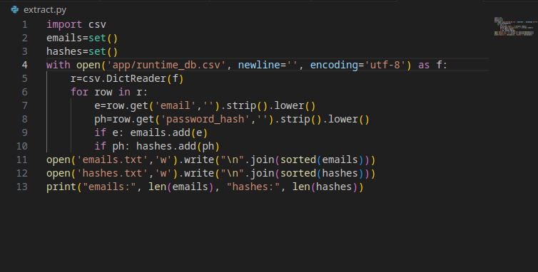
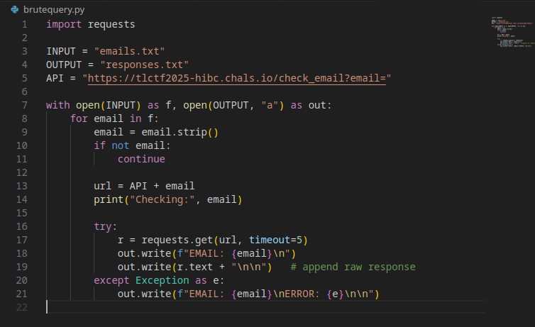
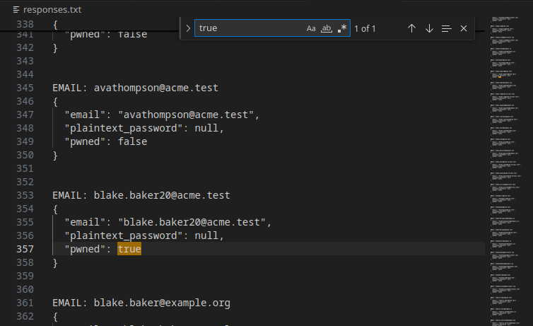
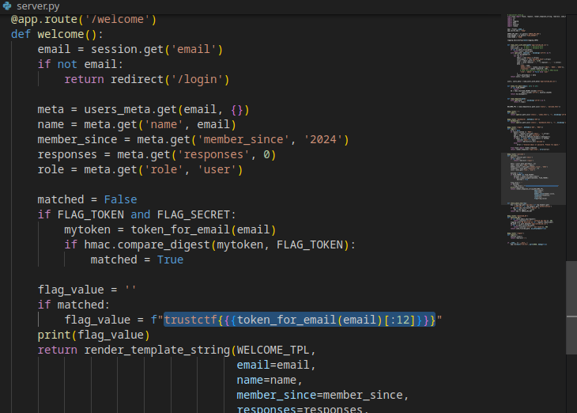
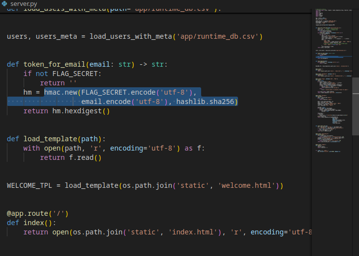

# Breached - CTF Challenge Writeup

**Challenge Name:** Breached  
**CTF:** TrustCTF  
**Category:** Data Privacy  
**Flag:** `trustctf{aefefb18de55}` 

---

## Challenge Overview

This challenge involves a "Have I Been Pwned" style breach checking API where users can query if their email has been compromised. The challenge provides an API endpoint for checking breach status and downloading a database. The goal is to identify breached admin accounts and compute the flag using HMAC-SHA256.

**Challenge URL:** `https://tlctf2025-hibc.chals.io`

---

## Initial Analysis

### Step 1: Database Download

The challenge provides an endpoint to download the runtime database using an admin API key:

```bash
# Download the database
curl "https://tlctf2025-hibc.chals.io/download_db?api_key=<ADMIN_API_KEY>" \
  -o runtime_db.csv
```

This CSV file contains user records with email addresses and potentially other user information.

### Step 2: Email Extraction

Created a Python script (`extract.py`) to parse the CSV and extract all email addresses:

This generates `emails.txt` containing all email addresses from the database.



---

## Analysis and Discovery

### Step 3: Brute Force Breach Checking

Created a script to query the breach checking endpoint for each email address:

This generates `responses.txt` with breach status for all users.



### Step 4: Identifying Breached Admin

Searched through `responses.txt` for entries with `"pwned": true`:

```bash
grep '"pwned": true' responses.txt
```

**Discovery:** Found breached admin email: `blake.baker20@acme.test`



---

## Exploitation

### Step 5: Understanding Flag Generation

Examining the server source code (`server.py`) revealed the flag generation mechanism:



The flag is constructed by:
1. Computing HMAC-SHA256 of the admin email using `FLAG_SECRET`
2. Taking the first 12 characters of the hex digest
3. Wrapping in `trustctf{...}` format



### Step 6: Computing the Flag

With the breached admin email `blake.baker20@acme.test` and access to the FLAG_SECRET (from the challenge environment or leaked data), we compute:

```python
import hmac
import hashlib

admin_email = "blake.baker20@acme.test"
FLAG_SECRET = "<secret_from_challenge>"

token = hmac.new(
    FLAG_SECRET.encode(),
    admin_email.encode(),
    hashlib.sha256
).hexdigest()

print(f"HMAC-SHA256: {token}")
print(f"Flag: trustctf{{{token[:12]}}}")
```

**Result:**
- HMAC-SHA256: `aefefb18de559dc272e7789ba617064886b1f953d953d6e963070ce7dd3bcda1`
- Flag: `trustctf{aefefb18de55}`

---

## Solution Summary

**Vulnerability Type:** Information Disclosure + Insecure Direct Object Reference (IDOR)  
**Root Cause:** Database download endpoint exposed all user data, allowing enumeration of breached accounts  
**Exploit Method:** 
1. Download complete user database
2. Extract all email addresses
3. Enumerate breach status for all users
4. Identify breached admin account
5. Compute HMAC-SHA256 flag token

**Flag:** `trustctf{aefefb18de55}`

---

## Tools Used

- **curl** - Database download and API testing
- **Python 3** - CSV parsing, HTTP requests, HMAC computation
- **grep** - Searching for breached accounts
- **bash** - Automation and scripting

---
